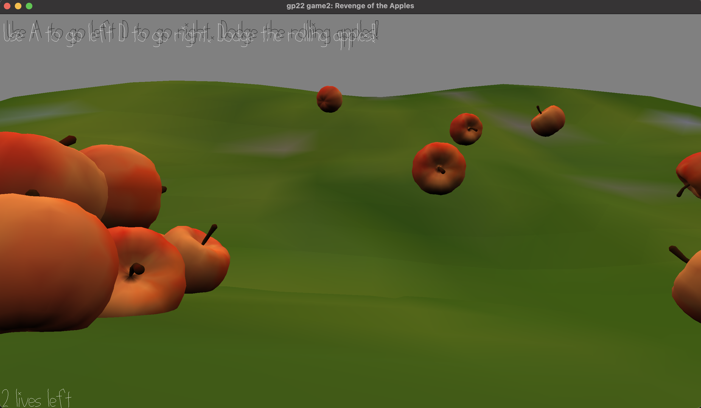

# Revenge of the Apples

Author: Ashley Kim

Design: Dodge the apples that are rolling down the hill to crash you, a worm.

Screen Shot:

## How To Play: ##

Use **'A'** and **'D'** keys to move left and rigth to dodge the apples rolling down the hill.

**STORY:**
You are a worm who likes to eat and make holes in the apples. 
The apple committee decided that your behavior of punching holes through the apples is unacceptable, so they decided to go after you. 
Dodge the apples that are rolling down the hill to survive.

## Other: ##
Helpful [doc link](https://victorkarp.com/how-to-bake-textures-to-vertex-colors-in-blender/) for vertex color bake in blender.

This game was built with [NEST](NEST.md).
